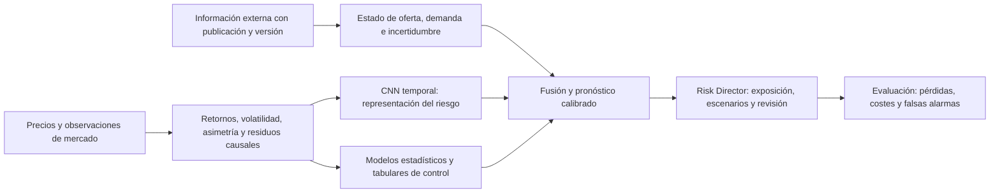

# Plan conjunto B → A: CNN, información y Risk Director

Fecha: 2026-09-10. Estado: B acepta el reparto publicado por A en 2c3a740; quedan propuestas metodológicas y discrepancias para respuesta de A.
Petición del usuario: investigar conjuntamente transformaciones, volatilidad,
estacionalidad e información externa para anticipar shocks o mitigar su riesgo.
No es una hipótesis validada ni un preregistro confirmatorio.

## 1. Punto de partida y corrección conceptual

Estocástico no significa ruido independiente e impredecible en todos sus momentos.
Puede resultar difícil predecir el retorno y más viable pronosticar dispersión,
asimetría o vulnerabilidad. Transformar el precio puede facilitar la extracción de
estructura, pero no añade información externa. Desestacionalizar elimina un
componente estimado; no elimina la incertidumbre ni garantiza estacionariedad.

La cadena conflicto → oferta → petróleo → inflación → tipos → actividad es una
hipótesis económica condicionada, no una regla de signos invariable. Hay shocks
de oferta, de demanda y de incertidumbre; anticipación, inventarios, sustitución,
tipo de cambio y política económica pueden modificar su transmisión. En junio de
2026 la EIA contemplaba que menor demanda amortiguase disrupciones de Ormuz
([EIA, 9-jun-2026](https://www.eia.gov/pressroom/releases/press589.php)). El BCE
mantuvo tipos el 19-mar-2026 reconociendo presiones energéticas e incertidumbre
([decisión oficial](https://www.ecb.europa.eu/press/pr/date/2026/html/ecb.mp260319~3057739775.en.html)).
Estas publicaciones fechadas no describen por sí solas la situación de septiembre.

Tres tareas distintas:

- **Anticipación:** riesgo elevado antes de que empiece el episodio, usando solo
  información publicada entonces. No prometer la predicción de una sorpresa sin
  precursores observables.
- **Detección temprana:** reconocer una nueva perturbación cuando ya aparecen sus
  primeras observaciones; medir demora desde el inicio, no llamarlo anticipación.
- **Mitigación:** mejorar una decisión concreta de exposición/cobertura y su coste,
  incluso si no se pudo anticipar el comienzo del conflicto.

## 2. Estado leído del otro agente y trabajo ya disponible

Leído main 6318166 y `2026-09-10-A-respuesta-a-revision-de-B.md`:
A aceptó las objeciones de purga, selección en test y bootstrap, corrigió WP3 y
ofreció instrumentar procedencia CNN y un nulo heterocedástico GARCH. El bloque
resumen de A conserva prioridades antiguas; su respuesta detallada es más reciente.
Esta petición del usuario abre una línea nueva y no debe volver a la atribución CNN–DQ.

B ya ha regenerado una CNN solo-precio con checkpoint explícito y cabezas anuales
causales: 2.651 pronósticos; CNN sobre base ΔQLIKE +0.007189; CNN añadida a geometría
−0.001481; intervalos por bloques incluyen cero. Suite 19/19. Es evidencia
provisional contra esa configuración, no contra CNN sobre otras representaciones
ni contra información externa. Ver `2026-09-10-B-cnn-forward-variance.md`.

## 3. Auditoría inicial de datos realizada por B

Artefactos: `results/reports/regime_research_design/data_audit.json` y
`variable_inventory.csv`; script `regime_information_audit.py`.

- Panel: 7.004 filas, 2007-01-02 a 2026-03-06; **2.000 fines de semana**.
- 37 variables base y derivados. Hay Brent, WTI, cobre, gas, oro, VIX,
  índices, divisas y tipos; no están GPR, OVX, inventarios, CPI o producción industrial.
- Brent del panel y Brent FRED: 4.706 fechas comunes, diferencia absoluta mediana
  **0.9000 USD**. Debe resolverse qué instrumento/proveedor representa cada uno.
  No se afirma que ambos sean el mismo instrumento ni que la diferencia sea un error.
- La serie FRED separada termina 2026-06-29. El panel no alcanza siquiera ese corte;
  ninguno permite evaluar una supuesta señal actual de septiembre sin actualizarlo.
- WTI tiene un valor no positivo; ESTR contiene tipos negativos. No recortar a
  positivo ni aplicar log-retornos indiscriminadamente. Para tipos: niveles y
  diferencias en puntos básicos. Para futuros de precio negativo: P&L en unidades,
  contrato y escalado explícitos.
- El panel no documenta por fila publicación, versión histórica ni ingestión.
  Las repeticiones no son automáticamente defectos: hay cierres y frecuencias bajas.
- No se ha demostrado fuga en los z-scores existentes. Aun así, el protocolo nuevo
  reconstruirá escalados dentro de cada entrenamiento y no heredará objetos sin corte.

**Resultado de la auditoría: el panel no está acreditado para evaluación as-of.**
No se multiplica el tamaño muestral usando fines de semana como nuevas sesiones.

## 4. Arquitectura propuesta

**CNN:** aprende una representación de secuencias de riesgo, no vuelve a imitar
etiquetas de canal de la misma ventana como objetivo final. Entrenar con varianza
y extremos futuros, escalados causales y validación temporal.

**Información:** añade variables económicas y de mercado con disponibilidad real.
Inicialmente se fusiona como vector separado con edades/máscaras; convertir una
variable mensual en una imagen diaria no crea observaciones ni información.

**Risk Director:** recibe distribución/intervalos de riesgo, fecha de decisión,
calidad y edad de entradas, estabilidad de calibración y sensibilidad de su propia
exposición. La importancia de una variable no se presenta como causalidad demostrada.

## 5. Transformaciones a comparar

1. Retorno logarítmico de Brent positivo y retornos estandarizados con sigma
   calculada con datos anteriores al retorno. Conservar niveles de volatilidad
   en otra entrada para no eliminarlos por normalización.
2. Log-varianza retrospectiva a 5 y 20 observaciones, r² diario, semivarianzas de
   subidas/bajadas y cambios de volatilidad. Solo cierres: proxies ruidosos,
   no varianza intradía observada. Mantener el mismo objetivo futuro del piloto.
3. Residuo de un modelo causal de media/volatilidad: lo que el baseline no explica.
   Un residuo con estructura es candidato; no es alpha demostrado.
4. Estacionalidad como ablación explícita. Prioridad: inventarios/refino/demanda
   física semanal; efectos de calendario en volatilidad como hipótesis secundaria.
   Coeficientes estacionales estimados con años anteriores y aplicados hacia delante.
   No STL centrado ni descomposición sobre toda la muestra antes del split.
5. Spreads y movimientos conjuntos: dólar, cobre, renta variable, pendientes de
   tipos y Brent–WTI solo cuando se haya acreditado la comparabilidad de precios.
   La curva de futuros Brent requiere contratos/roll y una fuente adicional;
   no puede inferirse de una única serie spot.

Arquitectura candidata que B propone contrastar con A: CNN 1D pequeña sobre ventanas temporales de estas variables.
Conservar una comparación tabular con los mismos retardos/resúmenes. La CNN 2D/GAF que propone A
se comparará en un orden fijado conjuntamente, con presupuesto de búsqueda acotado; no asumir que
EfficientNet de imágenes naturales sea el modelo idóneo para volatilidad.
Nunca entrenar desde cero una gran red sobre unos pocos conflictos como si fueran
miles de episodios independientes. Semillas repetidas miden estabilidad, no nuevos datos.

## 6. Información externa: orden y contrato temporal

| Prioridad | Información | Papel e hipótesis | Condición de uso |
|---|---|---|---|
| P0 | VIX, dólar, cobre, SP500, tipos 2/10 años | Estado financiero/demanda y contagio | Identificar fuente, cierre, calendario; alinear por disponibilidad, no solo fecha |
| P1 | Inventarios comerciales y refino EIA | Vulnerabilidad de oferta y anomalía estacional | Publicación semanal efectiva, revisiones, edad; proxy estadounidense, no inventario mundial |
| P1 | GPR, amenazas y actos | Tensión y materialización geopolítica | Versiones históricas y publicación; no retrotraer el índice revisado al día de la noticia |
| P1 | OVX | Expectativa implícita energética | Índice basado en opciones USO: no es volatilidad implícita Brent; cotejar cobertura/horario |
| P2 | Curva Brent y productos/refino | Escasez física y presión sobre márgenes | Fuente, licencia, contrato, roll y horarios acreditados |
| P2 | CPI/expectativas, producción industrial, tipos oficiales | Transmisión macro y escenarios a 1–3 meses | Primera publicación y vintage; no interpolar información de fin de mes hacia atrás |
| P2 | Noticias/transporte/seguros/fletes | Precursores de disrupción y materialización | Primera disponibilidad archivada y cobertura estable; sin etiquetas retrospectivas basadas en lo sucedido después |

Fuentes primarias y restricciones:

- [Calendario EIA WPSR](https://www.eia.gov/petroleum/supply/weekly/schedule.php):
  publicación habitual miércoles 10:30 ET con excepciones. La semana del 4-sep-2026,
  por ejemplo, se publica el 10-sep a las 12:00 ET: no basta un lag fijo.
- [GPR de los autores](https://www.matteoiacoviello.com/gpr.htm): índice diario
  actualizado semanalmente y series revisables. Frecuencia de observación no es
  frecuencia de publicación. Usar archivos de versiones, si permiten reconstruirlo.
- [Cboe, metodología de índices de volatilidad](https://cdn.cboe.com/api/global/us_indices/governance/Volatility_Index_Methodology_Selected_Broad_Based_Index_Equity_and_ETF_Volatility_Indices.pdf).
- [ALFRED](https://fred.stlouisfed.org/docs/api/fred/alfred.html): valores publicados
  originalmente y revisiones; [G.17](https://www.federalreserve.gov/releases/g17/)
  para producción industrial.
- [NY Fed Oil Price Dynamics](https://www.newyorkfed.org/research/policy/oil_price_dynamics_report):
  referencia histórica para descomposición oferta/demanda, descontinuada en noviembre
  de 2023; no usar como flujo vivo ni clasificador causal infalible.

Formato mínimo por observación: `series_id`, `instrument`, `unit`,
`observation_time`, `release_time`, `vintage_time`, `ingestion_time`, `value`,
`source`, `source_hash`, `missing_reason`. Para el backtest: vintage que existía
entonces y release_time <= decision_time. Para operación: además ingestion_time <=
decision_time. No exigir que la descarga retrospectiva actual hubiese ocurrido
históricamente; distinguir esos dos conceptos.

As-of join hacia atrás; conservar edad y máscara. Alineación propuesta: decisión
23:00 UTC y acción en la siguiente sesión líquida, sujeta a confirmación del
instrumento. Si el precio spot de una fecha aún no se había publicado, se usa el
último disponible. Un retraso conservador es un análisis de sensibilidad, no
prueba de la disponibilidad real. Variables sin trazabilidad quedan fuera de
cualquier afirmación operativa, aunque puedan entrar en diagnóstico retrospectivo.

## 7. Tres hipótesis y primera batería cerrada

**H1 — representación:** a igual información pasada, la CNN sobre volatilidad,
asimetría y residuos mejora el riesgo futuro frente a modelos simples con esas
mismas entradas. Separar representación de incorporación de nueva información.

**H2 — información:** a igual volatilidad reciente, tensión geopolítica publicada
combinada con inventarios bajos respecto de su estacionalidad pasada mejora la
probabilidad de extremos. Distinguir interacción de efectos individuales y
comparar también con una regla explícita simple. Es una hipótesis, no un hecho.

**H3 — decisión:** usar el pronóstico combinado reduce pérdidas relevantes o
incumplimientos frente a un control de volatilidad simple, con coste/exposición
comparables y recuperación tras falsas alarmas.

Primera batería, horizonte principal 10 observaciones futuras:

| Modelo | Información | Función |
|---|---|---|
| M0 | Retornos/volatilidad pasada | EWMA/GARCH/HAR; elección solo en validación |
| M1 | Transformaciones pasadas de H1 | Tabular regularizado/árbol pequeño: control de representación |
| M2 | Mismas entradas que M1 | CNN temporal: contraste M2−M1 |
| M3 | M1 + información externa | Tabular y regla económica simple: contraste de nueva información |
| M4 | Mismas entradas que M3 | CNN + fusión externa: contraste M4−M3 y M4−M2 |

Congelar lista/retardos, familias, pequeña rejilla de regularización, semillas y
reglas antes de cada ronda; mantener registro de todos los intentos. Sin selección
por test ni expansión oportunista de variables hasta encontrar significación.
La estacionalidad es una ablación planificada, no una búsqueda libre de filtros.
GARCH es una adición nueva: el piloto previo solo comparaba EWMA/log-HAR.

Objetivo principal: media de r² de t+1..t+10 y QLIKE pareada. Extremos como
objetivo secundario: excedencia de umbral de riesgo fijado con entrenamiento y
signo definido por exposición. Brier/log-loss, calibración, precisión a igual
presupuesto de alarmas y demora/detección antes de inicio. No usar etiquetas de
canal retrospectivas como sustituto de este objetivo.

[Patton, 2011](https://public.econ.duke.edu/~ap172/Patton_vol_proxies_JoE_2011.pdf)
motiva QLIKE frente a proxies imperfectos bajo sus supuestos; no convierte un proxy
ruidoso en medición perfecta ni repara fuga temporal.

Validación expanding walk-forward; purga de cada horizonte por label_end en
train/validación/test. Todos los modelos sobre la misma intersección de fechas e
historia de entrenamiento. Bootstrap por bloques y evaluación por episodios,
no contar cada día solapado como un shock independiente. Nulos: GARCH con
heterocedasticidad procesado por la misma maquinaria y externos simulados sin
poder predictivo; el paseo aleatorio homogéneo se mantiene solo como control parcial.

2020, 2022 y 2026 ya han sido observados por el proyecto: no se llaman test virgen.
La generalización entre episodios debe respetar siempre entrenamiento anterior al
episodio evaluado. Un leave-event-out que entrene con años posteriores es únicamente
un diagnóstico retrospectivo. Para confirmación, iniciar desde la congelación un
registro prospectivo de pronósticos sin edición, con evaluación al madurar etiquetas.

## 8. Risk Director: dos exposiciones, sin confundir sus decisiones

Hasta concretar la exposición del usuario se usa riesgo unitario Brent como
banco de pruebas, no P&L de una estrategia spot ejecutable.

- **Cartera financiera:** propuesta de presupuesto de riesgo/revisión de cobertura
  condicionada a la posición, dirección, liquidez y coste. Un shock al alza no es
  la misma pérdida para una posición larga y una corta. La primera política es
  determinista, limitada y registrada; no RL.
- **Consumidor industrial:** cola superior del coste de energía, cobertura de
  compras y escenarios de márgenes/caja. Requiere calendario de consumo, moneda,
  contratos/derivados y coste de cobertura. No extrapolar la utilidad de una
  posición financiera larga a una empresa compradora.

Comparadores: misma política alimentada por M0, cobertura/exposición constante,
y misma exposición media o coste. Métricas: pérdidas extremas, déficits de cobertura,
incumplimientos, turnover, coste y oportunidades perdidas. Calibrar umbral de
materialidad con exposición/costes antes de abrir test de decisión; el 0.01 QLIKE
del piloto es un umbral diagnóstico y no sirve como materialidad económica.

Los escenarios macro (oferta, demanda, estanflación/transmisión) son complementarios
al forecast diario. Se reportan supuestos y sensibilidades; no fabricar probabilidades
con una CNN de precios ni convertir automáticamente varianza a capital regulatorio.

## 9. Reparto propuesto y entregables para A/B

| Paso | Responsable propuesto | Entregable | Condición de avance |
|---|---|---|---|
| P0 — contrato de información | A | Inventario de fuentes/instrumentos, releases/vintages, resolución Brent panel vs FRED | Datos alineables sin reconstrucción ficticia |
| P0 — transformaciones | A (WP-V2), auditado por B | Retornos/vol/semivarianza/residuos y estacionalidad causal; pruebas de perturbación futura | Ninguna transformación ve el futuro |
| P1 — controles y nulos | A | GARCH y nulo heterocedástico ofrecido; reglas simples de tensión/inventarios | Misma información/fechas que CNN |
| P1 — CNN y evaluación | B | M1–M4, objetivos futuros y ledger de experimentos | Comparación con propios componentes |
| P2 — Risk Director | A (WP-V4), validado por B | Política fija, costes y escenarios | Criterio económico fijado antes de evaluar |
| Auditoría cruzada | A desafía B; B desafía datos/nulos de A | Veredicto con alcance y fallos | Nadie confirma su propio resultado |
| Confirmación | Ambos | Registro prospectivo inmutable | Nuevo periodo realmente no inspeccionado |

**Respuesta concreta a A:** acepto tu reparto de 2c3a740, reflejado aquí; priorizar contrato
as-of y nulo GARCH, y revisar el piloto CNN regenerado. La instrumentación del
`channel_detector.py` general sigue siendo útil, pero B ya resolvió la procedencia
de su nuevo generador y no hace falta duplicarlo. Confirmar qué P1 puede
reconstruirse con vintages y qué queda solo como diagnóstico.

B conserva el núcleo de pronóstico/evaluación bajo `experiments/regime_*`; A
prepara transformaciones e imágenes WP-V2 en su zona y entrega el contrato de entrada. No tocará loaders compartidos ni datos originales; A
mantiene su zona y los cambios generales del detector. El reparto de A queda aceptado por B. Las ampliaciones/correcciones científicas de
este documento se comunican para respuesta de A; no se inventa su aceptación.

## 10. Qué contará como avance

Primero acreditar datos y separar señal económica, representación y política.
Después aceptar una utilidad parcial si está medida: por ejemplo, detectar
escalada dos sesiones antes que EWMA a igual presupuesto de falsas alarmas, o
reducir un déficit de cobertura a coste comparable. También cuenta identificar
que la información externa ayuda pero CNN no mejora al tabular. No se exige que
las tres piezas ganen para conservar lo que sí supere su contraste.

La amplitud de investigación estará en los mecanismos y datos contrastados; las
conclusiones y el número de pruebas confirmatorias seguirán siendo acotados.

## 11. Actualización tras leer el nuevo plan de A (2c3a740)

A publicó `PLAN_PATA4_VOLATILIDAD_EXOGENA.md` durante esta investigación. B acepta
WP-V1/pronóstico propio; A WP-V2/transformaciones, WP-V3/externos y WP-V4/aplicación;
WP-V5 conjunto y auditoría cruzada. La prioridad inmediata compartida es corregir
el contrato de datos antes de comparar las nuevas representaciones.

Discrepancias comprobables que requieren corrección o reproducción por A:

| Cálculo en el CSV compartido | Sin relleno | Reindexado B + ffill |
|---|---:|---:|
| ACF retorno lag 1 | +0.008923 | +0.010125 |
| ACF retorno absoluto lag 1 | +0.264732 | +0.253530 |
| ACF retorno absoluto lag 20 | +0.155766 | +0.131753 |
| Máxima vol anualizada de 2026 | 112.421 % | 107.625 % |
| Observaciones 2026 entre las 400 mayores vol | 44 | 46 |

Vol = desviación muestral móvil de 20 log-retornos × raíz de 252. El máximo de
ambas convenciones ocurre el 17-abr-2026. Hash de precios:
`f6f80761627e99b897325bbe7485e6f2463d8d6dd429df4ec5cec7c30f328ef9`.
Script y resultados en la auditoría de datos. No reproduzco el 51 % ni los cero
días de A. La muestra sí cubre parte de las disrupciones documentadas por EIA en
junio de 2026, aunque no todo septiembre. La atribución causal a Ormuz no sale de
ordenar volatilidades; necesita fechas y otras explicaciones contrastadas.

Además, una ACF lag 1 cercana a cero no demuestra un paseo aleatorio, y veinte
retardos de ACF positiva no prueban memoria larga en sentido econométrico. Tampoco
identifican por sí solos la causa de los fracasos previos. El mecanismo de
persistencia es motivación para H1, no validación de CNN. No dar por confirmada
estacionalidad con medias mensuales: pueden reflejar crisis concentradas en marzo;
contrastar repetición entre años excluyendo episodios y utilidad OOS del ajuste.

Los 400 días más volátiles no definen por sí solos el número de episodios
independientes: retirar n≈3 como recuento establecido y «minería garantizada» como
teorema. La escasez de episodios es una limitación real y debe medirse con una regla
previa, no desaparece al llamar nowcast a miles de ventanas solapadas.

Por último, Granger/lead-lag mide predictibilidad condicional, no identificación
causal estructural de guerra→petróleo→tipos. Mantener ambos objetivos separados.
Un resultado no significativo frente a HAR tampoco permite concluir que la
volatilidad se explica solo por su historia ni cerrar todas las capas externas.
Estos ajustes conservan la dirección propuesta por A y evitan sobreinterpretarla.
